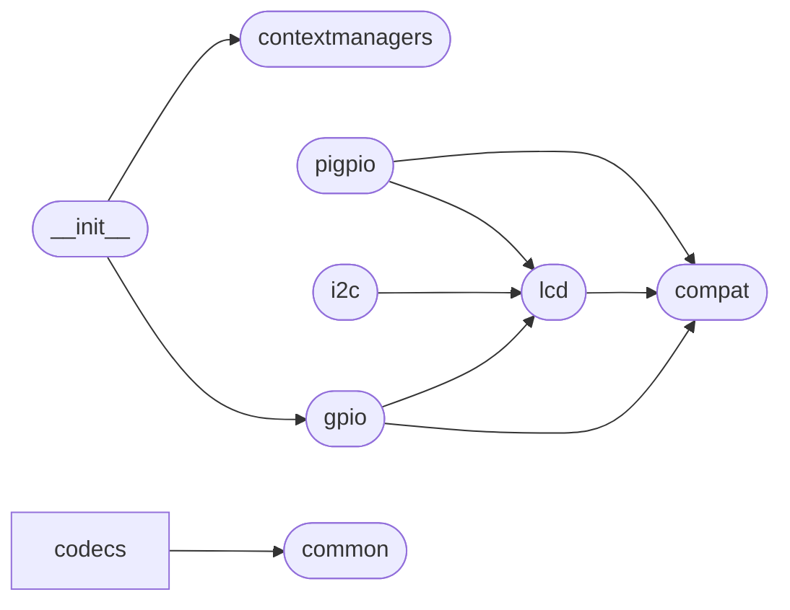

# Code Overview

[_Documentation generated by Documatic_](https://www.documatic.com)

<!---Documatic-section-Codebase Structure Python-start--->
## Codebase Structure Python

The codebase has a single-depth folder structure,
                with 12 code files in total.

<!---Documatic-block-system_architecture-start--->

<!---Documatic-block-system_architecture-end--->

# #
<!---Documatic-section-Codebase Structure Python-end--->

<!---Documatic-section-Key Objects-start--->
## Key Objects

There are exposed imports at level-0
from the source directory (RPLCD)

<!---Documatic-block-RPLCD-start--->

	
<code>RPLCD</code> (Click to Expand!)

* `RPLCD.contextmanagers.cleared`
* `RPLCD.contextmanagers.cursor`
* `RPLCD.gpio.CharLCD`

<!---Documatic-block-RPLCD-end--->

# #
<!---Documatic-section-Key Objects-end--->

<!---Documatic-section-Important Functions-start--->
## Important Functions

<!---Documatic-block-important_funcs-start--->
<!---Documatic-block-most_used_funcs-start--->
### Most Utilised Functions

* RPLCD.compat.range (3 times)
* RPLCD.contextmanagers.cursor (1 times)
* RPLCD.contextmanagers.cleared (1 times)
* RPLCD.common.sliding_window (1 times)
<!---Documatic-block-most_used_funcs-end--->

<!---Documatic-block-end_user_funcs-start--->
### End User Exposed Functions

* RPLCD.gpio.CharLCD
* RPLCD.contextmanagers.cleared
* RPLCD.contextmanagers.cursor
* RPLCD.__init__.CharLCD
<!---Documatic-block-end_user_funcs-end--->
<!---Documatic-block-important_funcs-end--->

# #
<!---Documatic-section-Important Functions-end--->

<!---Documatic-section-Class Hierarchy-start--->
## Class Hierarchy

<!---Documatic-block-RPLCD.codecs.__init__.A00Codec-start--->

	
<code>RPLCD.codecs.__init__.A00Codec</code> (Click to Expand!)

* RPLCD.codecs.__init__.A00Codec
* RPLCD.codecs.__init__.A02Codec
* RPLCD.codecs.__init__.ST0BCodec

<!---Documatic-block-RPLCD.codecs.__init__.A00Codec-end--->

<!---Documatic-block-RPLCD.lcd.BaseCharLCD-start--->

	
<code>RPLCD.lcd.BaseCharLCD</code> (Click to Expand!)

* RPLCD.gpio.CharLCD
* RPLCD.i2c.CharLCD
* RPLCD.pigpio.CharLCD

<!---Documatic-block-RPLCD.lcd.BaseCharLCD-end--->

<!---Documatic-block-object-start--->

	
<code>object</code> (Click to Expand!)

* RPLCD.common.Alignment
* RPLCD.common.CursorMode
* RPLCD.common.ShiftMode
* RPLCD.lcd.BaseCharLCD

<!---Documatic-block-object-end--->

# #
<!---Documatic-section-Class Hierarchy-end--->

[_Documentation generated by Documatic_](https://www.documatic.com)